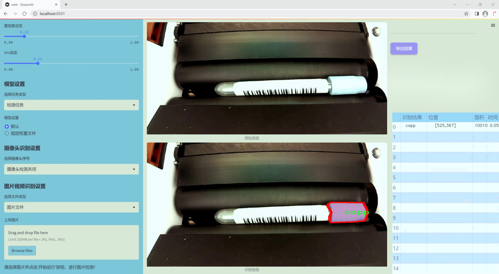
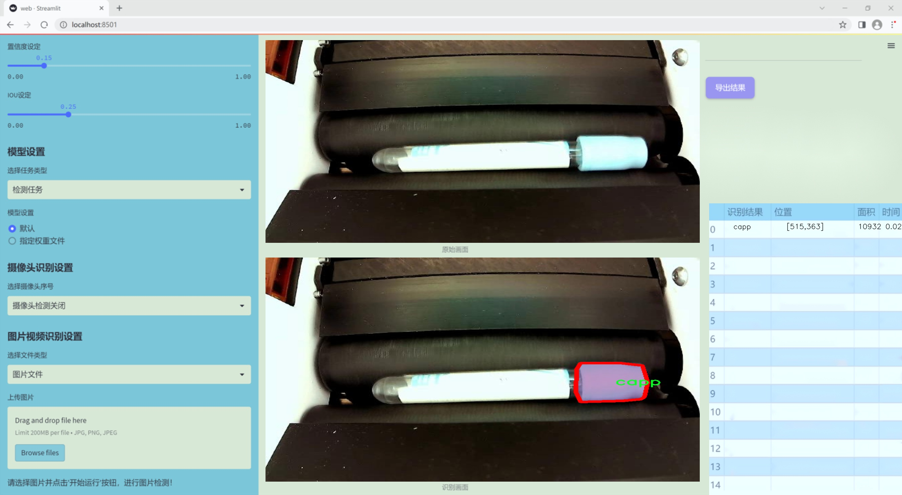
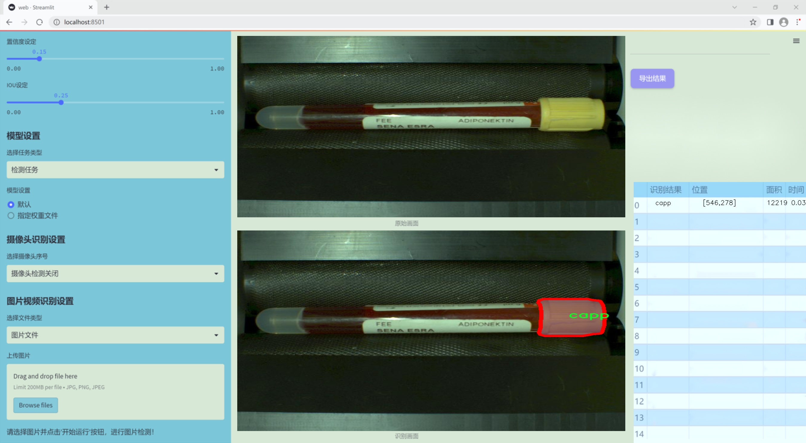
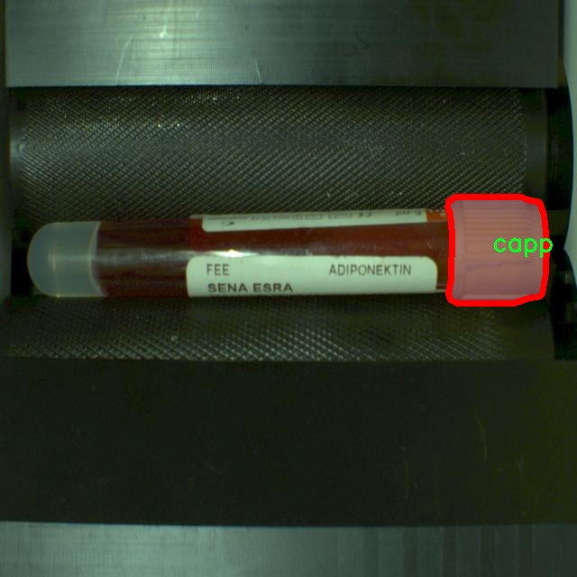
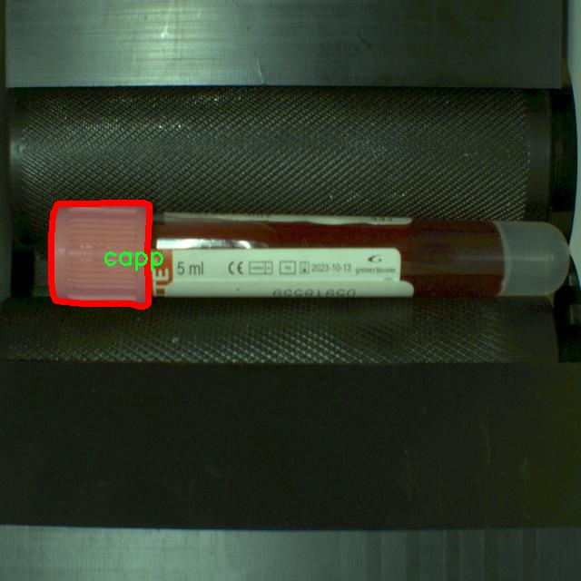
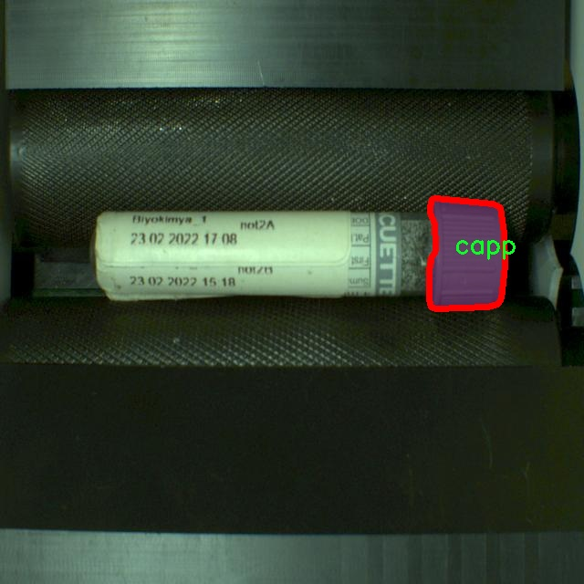

### 1.背景意义

研究背景与意义

随着医疗技术的不断进步，血液检测在疾病诊断和健康监测中扮演着越来越重要的角色。尤其是在采血管的使用中，如何高效、准确地识别和分割血液样本区域，成为了医学图像处理领域的一个关键问题。传统的图像处理方法往往依赖于手工特征提取，难以适应复杂多变的实际应用场景，且处理效率较低。因此，基于深度学习的计算机视觉技术，尤其是目标检测和实例分割技术，逐渐成为研究的热点。

YOLO（You Only Look Once）系列模型因其实时性和高准确率，广泛应用于各种视觉任务。YOLOv11作为该系列的最新版本，进一步提升了模型的性能和适应性。然而，针对特定领域的应用，如采血管血液区域的实例分割，仍然需要对模型进行改进和优化，以满足医疗行业对精度和效率的高要求。本研究旨在基于改进的YOLOv11模型，构建一个专门针对采血管血液区域的实例分割系统。

本项目所使用的数据集包含483张经过精确标注的图像，类别数量为1，主要针对“capp”这一特定目标进行实例分割。数据集的构建经过严格的预处理，确保了图像质量和标注的准确性。通过引入先进的深度学习技术，我们希望能够实现对采血管中血液区域的精准识别和分割，从而为后续的医学分析和诊断提供有力支持。

总之，本研究不仅有助于推动计算机视觉技术在医疗领域的应用，也为相关研究提供了新的思路和方法，具有重要的学术价值和实际意义。通过优化YOLOv11模型，我们期望能够提高血液样本处理的自动化水平，进而提升医疗服务的效率和质量。

### 2.视频效果

[2.1 视频效果](https://www.bilibili.com/video/BV1gZquY1EwD/)

### 3.图片效果







##### [项目涉及的源码数据来源链接](https://kdocs.cn/l/cszuIiCKVNis)**

注意：本项目提供训练的数据集和训练教程,由于版本持续更新,暂不提供权重文件（best.pt）,请按照6.训练教程进行训练后实现上图演示的效果。

### 4.数据集信息

##### 4.1 本项目数据集类别数＆类别名

nc: 1
names: ['capp']


该项目为【图像分割】数据集，请在【训练教程和Web端加载模型教程（第三步）】这一步的时候按照【图像分割】部分的教程来训练

##### 4.2 本项目数据集信息介绍

本项目数据集信息介绍

本项目旨在开发一种改进的YOLOv11模型，以实现对采血管中血液区域的实例分割。为此，我们构建了一个专门的数据集，命名为“cap-seg”，该数据集专注于采血管的血液区域，旨在为模型提供丰富的训练样本，以提高其分割精度和鲁棒性。数据集中包含的类别数量为1，具体类别为“capp”，代表采血管中的血液区域。这一单一类别的选择使得模型能够集中学习和识别该特定区域的特征，从而在实际应用中实现更高的分割准确性。

在数据集的构建过程中，我们收集了大量的采血管图像，涵盖了不同的光照条件、背景和采血管类型，以确保模型能够适应各种实际场景。这些图像经过精心标注，确保每个采血管中的血液区域都被准确地框定和标识。标注过程不仅考虑了血液的颜色和透明度，还考虑了不同采血管在不同条件下的表现，以提高模型的泛化能力。

此外，数据集还包含了多样化的样本，以反映临床环境中可能遇到的各种情况。这种多样性使得模型在面对不同的采血管图像时，能够更好地识别和分割血液区域，从而为后续的医学图像分析和处理提供支持。通过使用“cap-seg”数据集，我们期望能够显著提升YOLOv11在采血管血液区域实例分割任务中的表现，为医学影像处理领域带来新的突破。









### 5.全套项目环境部署视频教程（零基础手把手教学）

[5.1 所需软件PyCharm和Anaconda安装教程（第一步）](https://www.bilibili.com/video/BV1BoC1YCEKi/?spm_id_from=333.999.0.0&vd_source=bc9aec86d164b67a7004b996143742dc)


[5.2 安装Python虚拟环境创建和依赖库安装视频教程（第二步）](https://www.bilibili.com/video/BV1ZoC1YCEBw?spm_id_from=333.788.videopod.sections&vd_source=bc9aec86d164b67a7004b996143742dc)

### 6.改进YOLOv11训练教程和Web_UI前端加载模型教程（零基础手把手教学）

[6.1 改进YOLOv11训练教程和Web_UI前端加载模型教程（第三步）](https://www.bilibili.com/video/BV1BoC1YCEhR?spm_id_from=333.788.videopod.sections&vd_source=bc9aec86d164b67a7004b996143742dc)


按照上面的训练视频教程链接加载项目提供的数据集，运行train.py即可开始训练



     Epoch   gpu_mem       box       obj       cls    labels  img_size
     1/200     20.8G   0.01576   0.01955  0.007536        22      1280: 100%|██████████| 849/849 [14:42<00:00,  1.04s/it]
               Class     Images     Labels          P          R     mAP@.5 mAP@.5:.95: 100%|██████████| 213/213 [01:14<00:00,  2.87it/s]
                 all       3395      17314      0.994      0.957      0.0957      0.0843

     Epoch   gpu_mem       box       obj       cls    labels  img_size
     2/200     20.8G   0.01578   0.01923  0.007006        22      1280: 100%|██████████| 849/849 [14:44<00:00,  1.04s/it]
               Class     Images     Labels          P          R     mAP@.5 mAP@.5:.95: 100%|██████████| 213/213 [01:12<00:00,  2.95it/s]
                 all       3395      17314      0.996      0.956      0.0957      0.0845

     Epoch   gpu_mem       box       obj       cls    labels  img_size
     3/200     20.8G   0.01561    0.0191  0.006895        27      1280: 100%|██████████| 849/849 [10:56<00:00,  1.29it/s]
               Class     Images     Labels          P          R     mAP@.5 mAP@.5:.95: 100%|███████   | 187/213 [00:52<00:00,  4.04it/s]
                 all       3395      17314      0.996      0.957      0.0957      0.0845


###### [项目数据集下载链接](https://kdocs.cn/l/cszuIiCKVNis)

### 7.原始YOLOv11算法讲解


##### YOLOv11三大损失函数

YOLOv11（You Only Look Once）是一种流行的目标检测算法，其损失函数设计用于同时优化分类和定位任务。YOLO的损失函数通常包括几个部分：
**分类损失、定位损失（边界框回归损失）和置信度损失** 。其中，

  1. box_loss（边界框回归损失）是用于优化预测边界框与真实边界框之间的差异的部分。

  2. cls_loss（分类损失）是用于优化模型对目标类别的预测准确性的部分。分类损失确保模型能够正确地识别出图像中的对象属于哪个类别。

  3. dfl_loss（Distribution Focal Loss）是YOLO系列中的一种损失函数，特别是在一些改进版本如YOLOv5和YOLOv7中被引入。它的主要目的是解决目标检测中的类别不平衡问题，并提高模型在处理小目标和困难样本时的性能。

##### 边界框回归损失详解

box_loss（边界框回归损失）是用于优化预测边界框与真实边界框之间的差异的部分。


##### box_loss 的具体意义


##### 为什么需要 box_loss

  * 精确定位：通过最小化中心点坐标损失和宽高损失，模型能够更准确地预测目标的位置和大小。
  * 平衡不同类型的目标：使用平方根来处理宽高损失，可以更好地平衡不同大小的目标，确保小目标也能得到足够的关注。
  * 稳定训练：适当的损失函数设计有助于模型的稳定训练，避免梯度爆炸或消失等问题。

##### 分类损失详解

在YOLO（You Only Look
Once）目标检测算法中，cls_loss（分类损失）是用于优化模型对目标类别的预测准确性的部分。分类损失确保模型能够正确地识别出图像中的对象属于哪个类别。下面是关于cls_loss的详细解读：

##### 分类损失 (cls_loss) 的具体意义

  
分类损失通常使用交叉熵损失（Cross-Entropy
Loss）来计算。交叉熵损失衡量的是模型预测的概率分布与真实标签之间的差异。在YOLO中，分类损失的具体形式如下：


##### 为什么需要 cls_loss

  * 类别识别：cls_loss 确保模型能够正确识别出图像中的目标属于哪个类别。这对于目标检测任务至关重要，因为不仅需要知道目标的位置，还需要知道目标的类型。

  * 多类别支持：通过最小化分类损失，模型可以处理多个类别的目标检测任务。例如，在道路缺陷检测中，可能需要识别裂缝、坑洞、路面破损等多种类型的缺陷。

  * 提高准确性：分类损失有助于提高模型的分类准确性，从而提升整体检测性能。通过优化分类损失，模型可以更好地学习不同类别之间的特征差异。

##### 分布损失详解

`dfl_loss`（Distribution Focal
Loss）是YOLO系列中的一种损失函数，特别是在一些改进版本如YOLOv5和YOLOv7中被引入。它的主要目的是解决目标检测中的类别不平衡问题，并提高模型在处理小目标和困难样本时的性能。下面是对`dfl_loss`的详细解读：

##### DFL Loss 的背景

在目标检测任务中，类别不平衡是一个常见的问题。某些类别的样本数量可能远远多于其他类别，这会导致模型在训练过程中对常见类别的学习效果较好，而对罕见类别的学习效果较差。此外，小目标和困难样本的检测也是一个挑战，因为这些目标通常具有较少的特征信息，容易被忽略或误分类。

为了应对这些问题，研究者们提出了多种改进方法，其中之一就是`dfl_loss`。`dfl_loss`通过引入分布焦点损失来增强模型对困难样本的关注，并改善类别不平衡问题。

##### DFL Loss 的定义

DFL Loss
通常与传统的交叉熵损失结合使用，以增强模型对困难样本的学习能力。其核心思想是通过对每个类别的预测概率进行加权，使得模型更加关注那些难以正确分类的样本。

DFL Loss 的公式可以表示为：


##### DFL Loss 的具体意义**

  * **类别不平衡：** 通过引入平衡因子 α，DFL Loss 可以更好地处理类别不平衡问题。对于少数类别的样本，可以通过增加其权重来提升其重要性，从而提高模型对这些类别的检测性能。
  *  **困难样本：** 通过聚焦参数 γ，DFL Loss 可以让模型更加关注那些难以正确分类的样本。当 
  * γ 较大时，模型会对那些预测概率较低的样本给予更多的关注，从而提高这些样本的分类准确性。
  *  **提高整体性能** ：DFL Loss 结合了传统交叉熵损失的优势，并通过加权机制增强了模型对困难样本的学习能力，从而提高了整体的检测性能。


### 8.200+种全套改进YOLOV11创新点原理讲解

#### 8.1 200+种全套改进YOLOV11创新点原理讲解大全

由于篇幅限制，每个创新点的具体原理讲解就不全部展开，具体见下列网址中的改进模块对应项目的技术原理博客网址【Blog】（创新点均为模块化搭建，原理适配YOLOv5~YOLOv11等各种版本）

[改进模块技术原理博客【Blog】网址链接](https://gitee.com/qunmasj/good)


#### 8.2 精选部分改进YOLOV11创新点原理讲解

###### 这里节选部分改进创新点展开原理讲解(完整的改进原理见上图和[改进模块技术原理博客链接](https://gitee.com/qunmasj/good)【如果此小节的图加载失败可以通过CSDN或者Github搜索该博客的标题访问原始博客，原始博客图片显示正常】

### AutoFocus: Efficient Multi-Scale Conv简介

参考该博客提出了AutoFocus，一种高效的多尺度目标检测算法。相较于以前对整个图像金字塔进行处理，该方法以一种由表及里的姿态，仅处理哪些整体上看来很有可能存在小物体的区域。这个可以通过预测一张类别未知的分割图FocusPixels来得到。为了高效利用FocusPixels，另外一个算法用于产生包含FocusPixels的FocusChips，这样可以减少计算量并处理更更精细的尺度。在不同尺度上FocusChips所得到的检测结果综合时，会出现问题，我们也提供了解决问题的方案。AutoFocus在COCO上的结果有49.7%mAP（50%重叠下68.3%），与多尺度baseline相仿但是快了2.5倍。金字塔中处理的像素数量减少了5倍mAP只下降1%，在与RetinaNet采用相同的ResNet-101结构且速度相同时，高了10%mAP。

人类寻找物体是一个动态的过程，且寻找时间与场景的复杂度是直接相关的。当我们的眼神在不同的点之间漂移时，其他的区域会被我们有意忽视。然而，现在的检测算法是一种静态的推理过程且图像金字塔中的每个像素都受到了一样的对待，这使得过程变得没有效率。现在许多的应用都不强调实时性，而计算上的节省其实可以产生很大收益。

在COCO数据集中，虽然40%的物体都是小物体，但是它们一共只占了全图的0.3%。如果金字塔是3倍关系，则在高分辨率层要进行9倍的运算。XXX 。那么有没有办法在低分辨率下找出可能含有这些物体的区域呢？

以人眼方案类比，我们可以从低分辨率图像开始，找出有可能存在物体的区域再“聚集”到高分辨率。我们的AutoFocus会在一层中计算小物体的分割图FocusPixels，而在每一个FocusPixels上会用一个算法产生下一层所需要关注的chips。在COCO的最大分辨率层上我们可以只处理**20%的像素而性能不下降，如果只处理5%**也只下降1%而已。


图像金字塔与卷积神经网络对CV十分重要。然而卷积神经网络无法做到对尺度不敏感，所以为了不同大小的物体需要依赖图像金字塔。虽然训练已经有了高效的方法，但是其推断时间依然远离实际使用标准。

目标检测加速有很长历史了。常用的有特征近似以减少尺度、级联、特征金字塔，且最后一个最近很多人研究。

AutoFocus为速度与精度之间提供了一个平滑的折衷，指出可以在低分辨率下看出小物体的所在，从而节约计算。FocusPixels的计算较为容易。

先简单介绍一下SNIP，是一种多尺度的训练、推断算法。主要思想是训练针对某个特定scale的检测器而不是scale-invariant检测器。这样训练样本就局限于在某个尺度范围内，以适于这个检测器处理。比如在高分辨率仅处理小物体而高分辨率仅处理大物体，其优势在于训练时不用考虑尺度的变化。

由于训练时物体大小是已知的，我们在图像金字塔中可以忽略大量区域而只处理物体周围的区域。SNIPER说明这样低分辨率的训练与全图训练相比并不会降低性能。同样，在推断过程中如果可以在大分辨率图像上预测可能出现小物体的chip，我们也就不用处理整张高分辨率图片。在训练时，许多物体会被裁剪、扭曲，这可以当作是一种数据扩增，然而当这个情况在推断时出现，则会产生错误，所以我们还需要一个算法来整合不同尺度上的检测结果。

#### AutoFocus框架
如SIFT、SURF等传统分类特征包含两个组件，一个detector和一个descriptor。detector只包含轻量级的操作如DoG、LoG，用于在整张图片上找到感兴趣的区域；descriptor，一般来说计算量比较大，则只需要关注那些咸兴趣的区域。这个级联结构保障了图片处理的效率。

同样，AutoFocus框架也是用于预测感兴趣的区域，并丢弃在下一尺度不可能存在物体的区域，并将裁剪和缩放后的区域传递给下一尺度。AutoFocus由三个部分组成：FocusPixels，FocusChips和focus stacking。

#### FocusPixels
FocusPixels定义在卷积网络特征图的粒度之上（如conv5），如果特征图上某个像素与小物体有重叠则标注为一个FocusPixel。（小物体：面积处于一个网络的输入范围之内）。训练过程中，FocusPixels标注为正，某些与不在面积范围内的物体有重叠的像素标注为无效，其他像素标注为负。AutoFocus的训练目标是使在FocusPixels区域产生较大的激活值。

如果同时多个物体与同一像素重叠，优先给正标注。我们的网络输入是512x512，然后a,b,c取值分别是5,64,90。对于太大或太小的物体，我们认为当前尺度上没有足够人信息进行判断，所以会标定为无效。整个网络结构如下图。训练时加两层带ReLU的卷积(3x3和1x1)以及一个二分类softmax来预测FocusPixels。


#### FocusChip生成
推断过程中，我们标注输出概率大于阈值t的像素（这个参数可以控制加速比），得到一些连通域。对于每一个域，我们做一次膨胀使其包含一些有助于识别的周围信息，膨胀后相连的部分要合并。然后，我们生成一些包含连通域的chips（不同chips可能重叠，如有重叠则合并）。有些chip可能太小缺少必要信息，并使chip的大小变化很大，为了效率我们要求保证一个最小的chip size。算法流程如下：


#### 级联推断过程
我们的过程类似于图片金字塔的推断过程但是在过程中一步步去除不关注的图片区域。我们在最低分辨率上进行检测并生成chips，然后在这些chips再进行检测和生成chips。

#### Focus Stacking
这种级联分类器的一个问题是在chip边缘本来的大物体可能生成一些被剪裁的检测目标。在下一个尺度上，由于剪裁过了，所以会检测到小的、错误的正例False Positive。之前算法中的第二步膨胀其实就是为了保证没有物体会出现在chip的边缘。这样，当我们在局部图片chip的边缘检测到物体时，就可以把这个检测结果丢弃，即使其在SNIP的范围内。

也有一些物体在图片边缘的特殊情况。如果chip和图片共享一条边的话，我们会检查检测结果的其他边是否完全在里面，如果在，则保留它，否则丢弃。

在每一尺度得到有效检测结果后，我们可以将不同尺度上的结果进行整合，将这些结果映射到原图坐标系上。最后，非极大值抑制NMS用于聚集。网络结构如之前的图片所示。


### 9.系统功能展示

图9.1.系统支持检测结果表格显示

  图9.2.系统支持置信度和IOU阈值手动调节

  图9.3.系统支持自定义加载权重文件best.pt(需要你通过步骤5中训练获得)

  图9.4.系统支持摄像头实时识别

  图9.5.系统支持图片识别

  图9.6.系统支持视频识别

  图9.7.系统支持识别结果文件自动保存

  图9.8.系统支持Excel导出检测结果数据


### 10. YOLOv11核心改进源码讲解

#### 10.1 utils.py

以下是经过简化和注释的核心代码部分，保留了多尺度可变形注意力机制的实现和一些重要的初始化函数：

```python
import copy
import math
import numpy as np
import torch
import torch.nn as nn
import torch.nn.functional as F
from torch.nn.init import uniform_

def _get_clones(module, n):
    """克隆给定模块n次并返回一个模块列表。"""
    return nn.ModuleList([copy.deepcopy(module) for _ in range(n)])

def inverse_sigmoid(x, eps=1e-5):
    """计算张量的反sigmoid函数。"""
    # 限制x的范围在0到1之间
    x = x.clamp(min=0, max=1)
    # 避免对数计算中的除零错误
    x1 = x.clamp(min=eps)
    x2 = (1 - x).clamp(min=eps)
    return torch.log(x1 / x2)

def multi_scale_deformable_attn_pytorch(
    value: torch.Tensor,
    value_spatial_shapes: torch.Tensor,
    sampling_locations: torch.Tensor,
    attention_weights: torch.Tensor,
) -> torch.Tensor:
    """
    多尺度可变形注意力机制。

    参数:
    - value: 输入特征张量
    - value_spatial_shapes: 输入特征的空间形状
    - sampling_locations: 采样位置
    - attention_weights: 注意力权重

    返回:
    - output: 经过注意力机制处理后的输出张量
    """
    bs, _, num_heads, embed_dims = value.shape  # 获取输入张量的形状
    _, num_queries, num_heads, num_levels, num_points, _ = sampling_locations.shape  # 获取采样位置的形状

    # 将输入特征按照空间形状分割成多个部分
    value_list = value.split([H_ * W_ for H_, W_ in value_spatial_shapes], dim=1)
    # 将采样位置转换到[-1, 1]的范围
    sampling_grids = 2 * sampling_locations - 1
    sampling_value_list = []

    for level, (H_, W_) in enumerate(value_spatial_shapes):
        # 处理每个层级的特征
        value_l_ = value_list[level].flatten(2).transpose(1, 2).reshape(bs * num_heads, embed_dims, H_, W_)
        # 获取当前层级的采样网格
        sampling_grid_l_ = sampling_grids[:, :, :, level].transpose(1, 2).flatten(0, 1)
        # 使用双线性插值进行特征采样
        sampling_value_l_ = F.grid_sample(
            value_l_, sampling_grid_l_, mode="bilinear", padding_mode="zeros", align_corners=False
        )
        sampling_value_list.append(sampling_value_l_)

    # 调整注意力权重的形状
    attention_weights = attention_weights.transpose(1, 2).reshape(
        bs * num_heads, 1, num_queries, num_levels * num_points
    )
    
    # 计算最终输出
    output = (
        (torch.stack(sampling_value_list, dim=-2).flatten(-2) * attention_weights)
        .sum(-1)
        .view(bs, num_heads * embed_dims, num_queries)
    )
    
    return output.transpose(1, 2).contiguous()  # 返回调整后的输出
```

### 代码说明：
1. **_get_clones**: 该函数用于克隆一个模块n次，返回一个模块列表，通常用于创建多个相同的层。
2. **inverse_sigmoid**: 计算反sigmoid函数，主要用于在模型中处理概率值的转换。
3. **multi_scale_deformable_attn_pytorch**: 这是实现多尺度可变形注意力机制的核心函数。它接收输入特征、空间形状、采样位置和注意力权重，并返回经过注意力机制处理后的输出张量。具体步骤包括：
   - 分割输入特征以适应不同的空间层级。
   - 将采样位置转换到适合插值的范围。
   - 对每个层级的特征进行双线性插值采样。
   - 调整注意力权重的形状并计算最终输出。

这个文件 `utils.py` 是一个用于实现一些实用功能的模块，主要与深度学习中的模型构建和注意力机制相关。文件中包含了一些函数和方法，具体功能如下：

首先，文件导入了一些必要的库，包括 `copy`、`math`、`numpy` 和 `torch`，后者是一个流行的深度学习框架。接着，定义了一个公共接口 `__all__`，列出了模块中将被导出的函数。

接下来，定义了 `_get_clones` 函数，该函数用于创建一个给定模块的深拷贝列表。这个功能在构建复杂模型时非常有用，尤其是在需要多个相同层的情况下。

`bias_init_with_prob` 函数用于根据给定的概率值初始化卷积或全连接层的偏置。这个函数的返回值是通过对数几率计算得出的，常用于处理二分类问题中的偏置初始化。

`linear_init` 函数则用于初始化线性模块的权重和偏置。它使用均匀分布在一个特定的范围内初始化权重和偏置，这有助于模型在训练初期保持稳定。

`inverse_sigmoid` 函数计算张量的反sigmoid函数。该函数对输入进行限制，确保其在0到1之间，并使用对数运算来计算反sigmoid值，这在某些模型中可能用于概率的转换。

最后，`multi_scale_deformable_attn_pytorch` 函数实现了多尺度可变形注意力机制。该函数接收多个参数，包括值张量、空间形状、采样位置和注意力权重。它首先对输入的值进行分割，然后通过计算采样网格来进行插值操作。通过 `F.grid_sample` 函数，函数从不同的尺度中提取特征，并结合注意力权重进行加权求和，最终输出一个新的张量。

整体来看，这个模块提供了一些基础的工具函数，特别是在实现复杂的深度学习模型时，能够帮助开发者进行模块的初始化和注意力机制的计算。

#### 10.2 dyhead_prune.py

以下是经过简化和注释的核心代码部分：

```python
import torch
import torch.nn as nn
import torch.nn.functional as F

class DyReLU(nn.Module):
    """动态ReLU激活函数，能够根据输入自适应调整参数。"""
    def __init__(self, inp, reduction=4, lambda_a=1.0, use_bias=True):
        super(DyReLU, self).__init__()
        self.oup = inp  # 输出通道数
        self.lambda_a = lambda_a * 2  # 调整因子
        self.avg_pool = nn.AdaptiveAvgPool2d(1)  # 自适应平均池化层

        # 确定压缩比
        squeeze = inp // reduction
        self.fc = nn.Sequential(
            nn.Linear(inp, squeeze),  # 全连接层，输入到压缩
            nn.ReLU(inplace=True),  # ReLU激活
            nn.Linear(squeeze, self.oup * 2),  # 压缩到输出通道数的两倍
            h_sigmoid()  # 使用h_sigmoid激活
        )

    def forward(self, x):
        """前向传播函数。"""
        b, c, h, w = x.size()  # 获取输入的批次大小、通道数、高度和宽度
        y = self.avg_pool(x).view(b, c)  # 进行自适应平均池化并重塑形状
        y = self.fc(y).view(b, self.oup * 2, 1, 1)  # 通过全连接层并重塑形状

        # 分割y为两个部分
        a1, b1 = torch.split(y, self.oup, dim=1)  # 分割为a和b
        a1 = (a1 - 0.5) * self.lambda_a + 1.0  # 调整a的值
        out = x * a1 + b1  # 计算输出

        return out  # 返回最终输出

class DyDCNv2(nn.Module):
    """带有归一化层的可调变形卷积模块。"""
    def __init__(self, in_channels, out_channels, stride=1, norm_cfg=dict(type='GN', num_groups=16)):
        super().__init__()
        self.conv = ModulatedDeformConv2d(in_channels, out_channels, 3, stride=stride, padding=1)  # 可调变形卷积
        self.norm = build_norm_layer(norm_cfg, out_channels)[1] if norm_cfg else None  # 归一化层

    def forward(self, x, offset, mask):
        """前向传播函数。"""
        x = self.conv(x.contiguous(), offset, mask)  # 进行卷积操作
        if self.norm:
            x = self.norm(x)  # 进行归一化
        return x  # 返回卷积结果

class DyHeadBlock_Prune(nn.Module):
    """DyHead模块，包含多种注意力机制。"""
    def __init__(self, in_channels, norm_type='GN'):
        super().__init__()
        self.spatial_conv_high = DyDCNv2(in_channels, in_channels)  # 高层空间卷积
        self.spatial_conv_mid = DyDCNv2(in_channels, in_channels)  # 中层空间卷积
        self.spatial_conv_low = DyDCNv2(in_channels, in_channels, stride=2)  # 低层空间卷积
        self.spatial_conv_offset = nn.Conv2d(in_channels, 27, 3, padding=1)  # 偏移和掩码卷积

    def forward(self, x, level):
        """前向传播函数。"""
        offset_and_mask = self.spatial_conv_offset(x[level])  # 计算偏移和掩码
        offset = offset_and_mask[:, :18, :, :]  # 提取偏移
        mask = offset_and_mask[:, 18:, :, :].sigmoid()  # 提取掩码并应用sigmoid

        mid_feat = self.spatial_conv_mid(x[level], offset, mask)  # 中层特征
        sum_feat = mid_feat  # 初始化特征和

        # 处理低层特征
        if level > 0:
            low_feat = self.spatial_conv_low(x[level - 1], offset, mask)
            sum_feat += low_feat

        # 处理高层特征
        if level < len(x) - 1:
            high_feat = F.interpolate(self.spatial_conv_high(x[level + 1], offset, mask), size=x[level].shape[-2:], mode='bilinear', align_corners=True)
            sum_feat += high_feat

        return sum_feat  # 返回合并后的特征
```

### 代码注释说明：
1. **DyReLU**：实现了一个动态的ReLU激活函数，可以根据输入自适应调整参数。通过自适应平均池化和全连接层来生成动态的激活参数。
2. **DyDCNv2**：定义了一个带有归一化层的可调变形卷积模块。它通过偏移和掩码来进行卷积操作，并可选择性地进行归一化。
3. **DyHeadBlock_Prune**：构建了一个包含多种注意力机制的模块，使用不同层次的卷积来处理特征，并计算偏移和掩码。

这个程序文件 `dyhead_prune.py` 是一个基于 PyTorch 的深度学习模块，主要实现了动态头（Dynamic Head）中的一些组件，特别是与注意力机制和变形卷积相关的部分。文件中包含了多个类和函数，下面对其进行逐一说明。

首先，文件导入了必要的库，包括 PyTorch 的核心库和一些特定的模块，如 `mmcv` 和 `mmengine`，这些库通常用于计算机视觉任务中的模型构建和训练。

接下来，定义了一个 `_make_divisible` 函数，用于确保某个值可以被指定的除数整除，并且在某些情况下，确保不低于最小值。这在设计网络结构时，常用于调整通道数。

然后，定义了几个激活函数的类，包括 `swish`、`h_swish` 和 `h_sigmoid`。这些类继承自 `nn.Module`，并实现了相应的前向传播方法。`swish` 是一种新的激活函数，`h_swish` 和 `h_sigmoid` 则是对 ReLU 和 Sigmoid 的改进版本，通常用于提高模型的表现。

接下来是 `DyReLU` 类，这是一个动态 ReLU 激活函数的实现。它的构造函数中包含了多个参数，如输入通道数、缩减比例、是否使用偏置等。`forward` 方法根据输入的特征图计算动态的激活值，并可以选择性地应用空间注意力机制。

`DyDCNv2` 类实现了带有归一化层的变形卷积，使用了 `ModulatedDeformConv2d`。该类的构造函数接收输入和输出通道数、步幅以及归一化配置，并在前向传播中应用卷积和归一化。

最后，`DyHeadBlock_Prune` 类是整个模块的核心，结合了多种注意力机制。它的构造函数中初始化了多个变形卷积层和注意力模块。`forward` 方法负责计算特征图的偏移量和掩码，并根据不同层次的特征图进行融合，最终输出经过注意力机制处理的特征图。

整个文件的设计思路是通过动态的激活函数和变形卷积来增强模型的表达能力，特别是在处理多层次特征时，能够有效地结合不同层次的信息，提升模型的性能。

#### 10.3 fast_kan_conv.py

以下是代码中最核心的部分，并附上详细的中文注释：

```python
import torch
import torch.nn as nn

# 定义径向基函数类
class RadialBasisFunction(nn.Module):
    def __init__(self, grid_min: float = -2., grid_max: float = 2., num_grids: int = 8, denominator: float = None):
        super().__init__()
        # 创建一个从grid_min到grid_max的均匀分布的网格
        grid = torch.linspace(grid_min, grid_max, num_grids)
        # 将网格设置为不可训练的参数
        self.grid = torch.nn.Parameter(grid, requires_grad=False)
        # 计算分母，如果未提供，则使用默认值
        self.denominator = denominator or (grid_max - grid_min) / (num_grids - 1)

    def forward(self, x):
        # 计算径向基函数的输出
        return torch.exp(-((x[..., None] - self.grid) / self.denominator) ** 2)

# 定义FastKAN卷积层类
class FastKANConvNDLayer(nn.Module):
    def __init__(self, conv_class, norm_class, input_dim, output_dim, kernel_size,
                 groups=1, padding=0, stride=1, dilation=1,
                 ndim: int = 2, grid_size=8, base_activation=nn.SiLU, grid_range=[-2, 2], dropout=0.0):
        super(FastKANConvNDLayer, self).__init__()
        # 初始化输入和输出维度、卷积参数等
        self.inputdim = input_dim
        self.outdim = output_dim
        self.kernel_size = kernel_size
        self.padding = padding
        self.stride = stride
        self.dilation = dilation
        self.groups = groups
        self.ndim = ndim
        self.grid_size = grid_size
        self.base_activation = base_activation()
        self.grid_range = grid_range

        # 检查参数的有效性
        if groups <= 0:
            raise ValueError('groups must be a positive integer')
        if input_dim % groups != 0:
            raise ValueError('input_dim must be divisible by groups')
        if output_dim % groups != 0:
            raise ValueError('output_dim must be divisible by groups')

        # 创建基础卷积层和样条卷积层
        self.base_conv = nn.ModuleList([conv_class(input_dim // groups,
                                                   output_dim // groups,
                                                   kernel_size,
                                                   stride,
                                                   padding,
                                                   dilation,
                                                   groups=1,
                                                   bias=False) for _ in range(groups)])

        self.spline_conv = nn.ModuleList([conv_class(grid_size * input_dim // groups,
                                                     output_dim // groups,
                                                     kernel_size,
                                                     stride,
                                                     padding,
                                                     dilation,
                                                     groups=1,
                                                     bias=False) for _ in range(groups)])

        # 创建归一化层
        self.layer_norm = nn.ModuleList([norm_class(output_dim // groups) for _ in range(groups)])

        # 初始化径向基函数
        self.rbf = RadialBasisFunction(grid_range[0], grid_range[1], grid_size)

        # 初始化dropout层
        self.dropout = None
        if dropout > 0:
            if ndim == 1:
                self.dropout = nn.Dropout1d(p=dropout)
            if ndim == 2:
                self.dropout = nn.Dropout2d(p=dropout)
            if ndim == 3:
                self.dropout = nn.Dropout3d(p=dropout)

        # 使用Kaiming均匀分布初始化卷积层的权重
        for conv_layer in self.base_conv:
            nn.init.kaiming_uniform_(conv_layer.weight, nonlinearity='linear')

        for conv_layer in self.spline_conv:
            nn.init.kaiming_uniform_(conv_layer.weight, nonlinearity='linear')

    def forward_fast_kan(self, x, group_index):
        # 计算基础卷积的输出
        base_output = self.base_conv[group_index](self.base_activation(x))
        if self.dropout is not None:
            x = self.dropout(x)
        # 计算样条卷积的输出
        spline_basis = self.rbf(self.layer_norm[group_index](x))
        spline_basis = spline_basis.moveaxis(-1, 2).flatten(1, 2)
        spline_output = self.spline_conv[group_index](spline_basis)
        # 返回基础输出和样条输出的和
        return base_output + spline_output

    def forward(self, x):
        # 将输入分割为多个组
        split_x = torch.split(x, self.inputdim // self.groups, dim=1)
        output = []
        for group_ind, _x in enumerate(split_x):
            # 对每个组应用fast kan卷积
            y = self.forward_fast_kan(_x.clone(), group_ind)
            output.append(y.clone())
        # 将所有组的输出拼接在一起
        return torch.cat(output, dim=1)
```

### 代码说明：
1. **RadialBasisFunction**: 该类实现了径向基函数，用于生成平滑的基函数输出。
2. **FastKANConvNDLayer**: 该类是一个通用的卷积层实现，支持多维卷积。它包括基础卷积和样条卷积的组合，并通过径向基函数生成样条基。
3. **forward_fast_kan**: 该方法实现了对输入的快速卷积操作，计算基础卷积和样条卷积的输出并相加。
4. **forward**: 该方法将输入分割为多个组，分别处理每个组的卷积操作，并将结果拼接在一起。

这个程序文件 `fast_kan_conv.py` 实现了一个基于快速径向基函数（Radial Basis Function, RBF）卷积的神经网络层，旨在提高卷积操作的效率和性能。文件中主要包含了几个类，分别是 `RadialBasisFunction`、`FastKANConvNDLayer` 以及其三个子类 `FastKANConv1DLayer`、`FastKANConv2DLayer` 和 `FastKANConv3DLayer`。

首先，`RadialBasisFunction` 类用于生成径向基函数。它的构造函数接受网格的最小值、最大值、网格数量和分母参数。网格通过 `torch.linspace` 生成，并被定义为一个不可训练的参数。分母的设置可以影响基函数的平滑程度。`forward` 方法则计算输入 `x` 与网格之间的距离，并通过指数函数生成相应的输出。

接下来，`FastKANConvNDLayer` 类是整个文件的核心，它继承自 `nn.Module`。这个类的构造函数接受多个参数，包括输入和输出维度、卷积核大小、分组数、填充、步幅、扩张、维度数、网格大小、基础激活函数、网格范围和 dropout 概率。该类会检查分组数的有效性，并确保输入和输出维度可以被分组数整除。然后，它会初始化基础卷积层、样条卷积层和层归一化层，使用 Kaiming 均匀分布初始化卷积层的权重。

`forward_fast_kan` 方法实现了快速 KAN 卷积的前向传播。它首先对输入应用基础激活函数，然后通过基础卷积层进行线性变换。接着，如果使用了 dropout，则对输入应用 dropout。之后，计算经过层归一化后的输入的样条基函数，并将其展平，最后通过样条卷积层进行处理。最终的输出是基础卷积和样条卷积的结果相加。

`forward` 方法则将输入张量按组分割，并对每个组调用 `forward_fast_kan` 方法，最后将所有组的输出拼接在一起。

最后，`FastKANConv1DLayer`、`FastKANConv2DLayer` 和 `FastKANConv3DLayer` 是对 `FastKANConvNDLayer` 的具体实现，分别针对一维、二维和三维卷积操作进行初始化，指定了相应的卷积和归一化层。

整体来看，这个文件实现了一个灵活且高效的卷积层，利用径向基函数来增强卷积操作的表现，适用于不同维度的输入数据。

#### 10.4 rmt.py

以下是经过简化和注释的核心代码部分：

```python
import torch
import torch.nn as nn
import torch.nn.functional as F

class DWConv2d(nn.Module):
    """ 深度可分离卷积层 """
    def __init__(self, dim, kernel_size, stride, padding):
        super().__init__()
        # 使用 groups=dim 实现深度可分离卷积
        self.conv = nn.Conv2d(dim, dim, kernel_size, stride, padding, groups=dim)

    def forward(self, x: torch.Tensor):
        ''' 前向传播函数，输入为 (b, h, w, c) 格式的张量 '''
        x = x.permute(0, 3, 1, 2)  # 转换为 (b, c, h, w)
        x = self.conv(x)  # 进行卷积操作
        x = x.permute(0, 2, 3, 1)  # 转换回 (b, h, w, c)
        return x

class MaSA(nn.Module):
    """ 多头自注意力机制 """
    def __init__(self, embed_dim, num_heads, value_factor=1):
        super().__init__()
        self.factor = value_factor
        self.embed_dim = embed_dim
        self.num_heads = num_heads
        self.head_dim = self.embed_dim * self.factor // num_heads
        self.key_dim = self.embed_dim // num_heads
        self.scaling = self.key_dim ** -0.5

        # 定义线性变换层
        self.q_proj = nn.Linear(embed_dim, embed_dim, bias=True)
        self.k_proj = nn.Linear(embed_dim, embed_dim, bias=True)
        self.v_proj = nn.Linear(embed_dim, embed_dim * self.factor, bias=True)
        self.lepe = DWConv2d(embed_dim, 5, 1, 2)  # 深度可分离卷积用于特征增强
        self.out_proj = nn.Linear(embed_dim * self.factor, embed_dim, bias=True)
        self.reset_parameters()

    def reset_parameters(self):
        # 初始化权重
        nn.init.xavier_normal_(self.q_proj.weight)
        nn.init.xavier_normal_(self.k_proj.weight)
        nn.init.xavier_normal_(self.v_proj.weight)
        nn.init.xavier_normal_(self.out_proj.weight)

    def forward(self, x: torch.Tensor, rel_pos):
        ''' 前向传播函数，输入为 (b, h, w, c) 格式的张量和相对位置编码 '''
        bsz, h, w, _ = x.size()
        q = self.q_proj(x)  # 计算查询
        k = self.k_proj(x)  # 计算键
        v = self.v_proj(x)  # 计算值
        lepe = self.lepe(v)  # 特征增强

        k *= self.scaling  # 缩放键
        qr = q.view(bsz, h, w, self.num_heads, -1).permute(0, 3, 1, 2, 4)  # 重塑查询
        kr = k.view(bsz, h, w, self.num_heads, -1).permute(0, 3, 1, 2, 4)  # 重塑键

        # 计算注意力权重
        qk_mat = qr @ kr.transpose(-1, -2) + rel_pos  # 加入相对位置编码
        qk_mat = torch.softmax(qk_mat, -1)  # 归一化

        output = torch.matmul(qk_mat, v)  # 计算输出
        output = output + lepe  # 加入增强特征
        output = self.out_proj(output)  # 最终线性变换
        return output

class FeedForwardNetwork(nn.Module):
    """ 前馈神经网络 """
    def __init__(self, embed_dim, ffn_dim, activation_fn=F.gelu, dropout=0.0):
        super().__init__()
        self.fc1 = nn.Linear(embed_dim, ffn_dim)  # 第一层线性变换
        self.fc2 = nn.Linear(ffn_dim, embed_dim)  # 第二层线性变换
        self.dropout = nn.Dropout(dropout)  # Dropout层
        self.activation_fn = activation_fn  # 激活函数

    def forward(self, x: torch.Tensor):
        ''' 前向传播函数 '''
        x = self.fc1(x)  # 线性变换
        x = self.activation_fn(x)  # 激活
        x = self.dropout(x)  # Dropout
        x = self.fc2(x)  # 线性变换
        return x

class VisRetNet(nn.Module):
    """ 可视化回归网络 """
    def __init__(self, in_chans=3, num_classes=1000, embed_dims=[96, 192, 384, 768], depths=[2, 2, 6, 2], num_heads=[3, 6, 12, 24]):
        super().__init__()
        self.patch_embed = PatchEmbed(in_chans=in_chans, embed_dim=embed_dims[0])  # 图像嵌入层
        self.layers = nn.ModuleList()  # 存储网络层

        # 构建每一层
        for i_layer in range(len(depths)):
            layer = BasicLayer(embed_dim=embed_dims[i_layer], depth=depths[i_layer], num_heads=num_heads[i_layer])
            self.layers.append(layer)

    def forward(self, x):
        ''' 前向传播函数 '''
        x = self.patch_embed(x)  # 嵌入图像
        for layer in self.layers:
            x = layer(x)  # 逐层传递
        return x

# 定义模型
def RMT_T():
    model = VisRetNet(
        embed_dims=[64, 128, 256, 512],
        depths=[2, 2, 8, 2],
        num_heads=[4, 4, 8, 16]
    )
    return model

if __name__ == '__main__':
    model = RMT_T()  # 创建模型实例
    inputs = torch.randn((1, 3, 640, 640))  # 随机输入
    res = model(inputs)  # 前向传播
    print(res.size())  # 输出结果尺寸
```

### 代码注释说明：
1. **DWConv2d**: 实现深度可分离卷积，用于减少参数数量和计算量。
2. **MaSA**: 实现多头自注意力机制，支持相对位置编码。
3. **FeedForwardNetwork**: 实现前馈神经网络，包含线性变换和激活函数。
4. **VisRetNet**: 主网络结构，包含图像嵌入和多个基本层。
5. **RMT_T**: 定义一个具体的模型实例，方便测试和使用。

以上代码展示了一个深度学习模型的基本结构，适用于图像处理任务。

这个程序文件 `rmt.py` 实现了一个基于视觉变换器（Vision Transformer）的深度学习模型，名为 VisRetNet。该模型设计用于处理图像数据，并包含多种模块和层，以实现高效的特征提取和表示。以下是对文件中主要组件的逐步说明。

首先，文件导入了必要的库，包括 PyTorch 和一些用于构建神经网络的模块。然后定义了一些基本的组件，如 `DWConv2d`，这是一个深度可分离卷积层，能够有效地处理输入张量的空间维度。它的 `forward` 方法负责调整输入的维度顺序，以适应卷积操作。

接下来，定义了 `RelPos2d` 类，用于生成二维相对位置编码。这对于注意力机制中的位置编码非常重要，能够帮助模型理解输入特征的空间关系。该类包含生成二维和一维衰减掩码的方法，允许在注意力计算中使用相对位置。

`MaSAd` 和 `MaSA` 类实现了不同的多头自注意力机制。`MaSAd` 是一种带有衰减机制的自注意力层，而 `MaSA` 则是标准的多头自注意力层。这些类的 `forward` 方法实现了自注意力的计算过程，包括查询、键、值的线性变换，以及基于相对位置的注意力权重计算。

`FeedForwardNetwork` 类实现了前馈神经网络，通常用于 Transformer 的每个层中。它包含两个线性层和激活函数，能够处理输入特征并生成输出。

`RetBlock` 类是一个包含注意力和前馈网络的残差块。它根据是否使用层缩放来调整输出，并通过位置卷积层增强特征表示。

`PatchMerging` 类用于将输入特征图分割成更小的补丁，并通过卷积操作进行降维。这是视觉变换器中常见的操作，旨在减少特征图的尺寸，同时增加通道数。

`BasicLayer` 类表示一个基本的 Transformer 层，包含多个 `RetBlock`。它还负责生成相对位置编码，并在层之间进行前向传播。

`LayerNorm2d` 类实现了二维层归一化，用于对特征图进行归一化处理，以提高模型的稳定性和收敛速度。

`PatchEmbed` 类负责将输入图像转换为补丁嵌入，使用卷积层提取特征并调整维度。

最后，`VisRetNet` 类是整个模型的核心，定义了模型的结构，包括嵌入层、多个基本层和输出层。它还包含模型的初始化方法，设置各层的参数，并定义前向传播过程。

在文件的末尾，定义了四个不同规模的模型构造函数（`RMT_T`、`RMT_S`、`RMT_B`、`RMT_L`），每个函数根据不同的参数配置返回一个对应的 `VisRetNet` 模型。

在 `__main__` 块中，示例代码创建了一个小型模型 `RMT_T`，并使用随机生成的输入数据进行前向传播，最后打印出每个输出特征图的尺寸。这展示了模型的基本用法和输出格式。

整体来看，这个文件实现了一个复杂的视觉变换器模型，包含了多种先进的技术和结构，旨在提高图像处理任务的性能。

### 11.完整训练+Web前端界面+200+种全套创新点源码、数据集获取


# [下载链接：https://mbd.pub/o/bread/Z5yYmptu](https://mbd.pub/o/bread/Z5yYmptu)